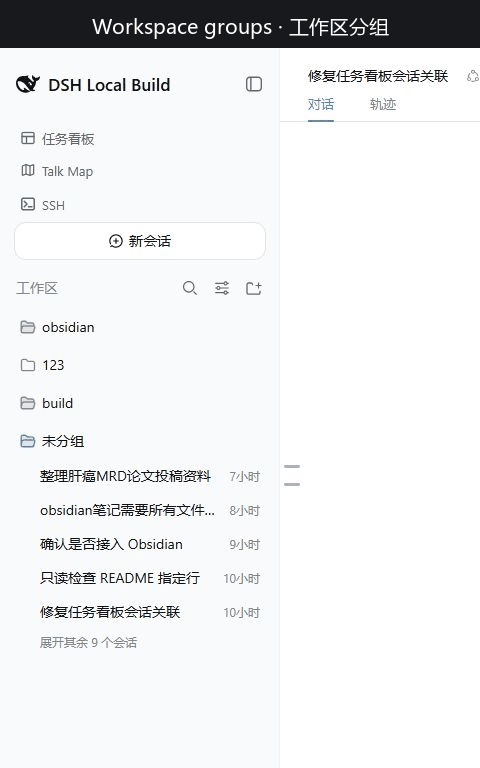

# dsh-session-workbench · Session management for DSH Web

English | [中文](README.zh.md)

<p align="center">
  <a href="https://github.com/Ruthtt/dsh-session-workbench/releases"></a>
  &nbsp;
  <a href="https://github.com/Ruthtt/dsh-session-workbench/actions/workflows/ci.yml"></a>
  &nbsp;
  
</p>

<p align="center">
  <strong>A focused Session workbench inside the familiar DeepSeek Harness sidebar</strong><br>
  <em>Group, search, reorder, migrate, export, archive, and delete Sessions without leaving dsh web</em>
</p>

<div align="center">

[What it is](#what-it-is) · [Features](#core-features) · [Quick start](#quick-start) · [Usage](#how-to-use) · [Compatibility](#compatibility) · [FAQ](#faq)

</div>

## What it is

`dsh-session-workbench` replaces the stock Workspace browsing region in the DeepSeek Harness Web GUI with a more deliberate Session management surface. It is designed for people who keep many long-running conversations across several repositories and need faster ways to find, arrange, move, back up, and clean up those Sessions.

The plugin keeps the native DSH experience around the enhanced controls: Workspace selection, new Session creation, search, rename, fork, archive, localization, and the compact sidebar rail continue to work in the same place. Installation uses the official Web profile mechanism and does not require modifying DSH source code.

<p align="center">
  
</p>

<p align="center"><sub>Recorded from a live DSH Web session. The workbench owns the Workspaces region; other entries above it are separate plugins in the local profile.</sub></p>

## Capability overview

| Area | What the workbench provides |
| --- | --- |
| Views | Group by Workspace or scan every Session in one flat list |
| Ordering | Keep a manual drag order or promote Sessions when they are updated |
| Search | Merge title matches with Host-backed conversation-content results |
| Drag and drop | Reorder Workspaces and Sessions, migrate a Session between Workspaces, or pass a Session reference to a compatible composer |
| Session lifecycle | Open, rename, fork, archive, ZIP export, and guarded permanent deletion |
| Workspace lifecycle | Add, rename, reorder, and remove Workspace entries without deleting their folders or Session logs |
| Dense navigation | Fold groups, preview the first five Sessions, reveal the remainder on demand, and keep unassigned Sessions under Ungrouped |

## Core features

### Organize a busy sidebar

- Switch between **WorkSpace** grouping and **In one list** from View options.
- Choose **Manual** ordering for a stable custom sequence or **Last updated** to surface recently active Sessions.
- Drag Workspace headers to persist their order and drag Session rows to arrange a Workspace in Manual mode.
- Fold quiet Workspace groups. Large groups show five Sessions first and reveal the rest only when requested.
- Keep Sessions that do not belong to a Workspace in a dedicated **Ungrouped** section.
- See status and relative activity time directly in each row, with Session identity available from the row details.

### Search titles and conversation history

The search field returns local title matches immediately and merges them with the Host's ranked conversation-content results. When content search is unavailable, the workbench keeps title search usable and reports the reduced mode instead of hiding the failure. Result counts are bounded, with a prompt to narrow broad queries.

### Drag Sessions between contexts

- **Inside one Workspace:** select Manual ordering and drag a Session before or after another Session.
- **Between Workspaces:** drag a Session onto a real destination Workspace. The Host creates an inherited child in the destination and archives the source only after the new Session is durable.
- **Into a compatible composer:** drag a Session to a composer that supports the shared pointer contract to insert a structured Session reference without moving the source.

Cross-Workspace migration is intentionally Host-authoritative. A busy or otherwise ineligible source can be rejected without changing either Workspace.

### Use complete Session actions

Each Session row keeps the familiar **Rename**, **Fork**, and **Archive** actions and adds two lifecycle tools:

- **Export Session** downloads a Host-generated ZIP containing the selected Session and its descendants.
- **Delete Session** opens an explicit confirmation dialog and permanently removes one persisted Session log.

Archive remains the safer, non-destructive choice for everyday cleanup. Permanent deletion is separate, visually guarded, and never triggered by drag and drop.

### Manage Workspaces without touching project files

Create or add a Workspace through the standard directory flow, start a new Session directly in a group, rename a Workspace, and drag Workspace headers into the preferred order. Removing a Workspace only removes its registry entry: the folder and Session logs remain, and its Sessions appear under **Ungrouped**.

## Quick start

### Requirements

- DeepSeek Harness with a working `dsh web` profile.
- DSH `0.1.1-rc.2` or newer.
- The matching Host extensions for permanent deletion and cross-Workspace migration. All other sidebar features can still load when those two extensions are absent.

### Install from GitHub

Install the release into the Web profile:

```sh
dsh plugin --profile web add github:Ruthtt/dsh-session-workbench
```

Restart `dsh web` after installation. The bundle disables the stock `ui-workspace` row because `sidebar.workspaces` has one owner, then mounts `dsh-session-workbench` in the same location.

### Verify the installation

Open the left sidebar and confirm that the Workspaces section has Search, View options, and Add workspace controls. Open a Session action menu to confirm that Export Session and Delete Session are available.

## How to use

### Keep a custom Session order

1. Open **View options**.
2. Set **Order by** to **Manual**.
3. Drag a Session row to its new position inside the same Workspace.

### Move a Session to another Workspace

1. Make sure the source Session is idle and the destination is a real Workspace, not Ungrouped.
2. Drag the Session row onto the destination Workspace or a Session position inside it.
3. Wait for the Host to create and attach the inherited child. The source is archived only after that succeeds.

### Export or permanently delete a Session

Open the Session action menu. Choose **Export Session** for a ZIP backup, **Archive Session** to hide it non-destructively, or **Delete Session** to enter the guarded permanent-deletion flow.

### Find an older Session

Use Search for a title, message fragment, filename, or other remembered text. The workbench combines fast local metadata matches with Host content search and shows the Workspace name beside each result.

## Compatibility

Version `0.1.0` is built and tested against DeepSeek Harness `0.1.1-rc.2`. The browser bundle is self-contained and uses official npm SDK packages for types and shared runtime modules.

| Feature | Required Host contract | Behavior when unavailable |
| --- | --- | --- |
| Sidebar, grouping, ordering, rename, fork, archive | Standard DSH client SDK | Available on the supported DSH version |
| ZIP export | `/api/session.export` | The download cannot start if the route is missing |
| Permanent Session deletion | `session.delete` | Shows a compatibility error and does not mutate storage |
| Cross-Workspace migration | `session.migrate` | Shows a compatibility error and leaves the source unchanged |
| Drag to composer | `dsh:session-pointer-drag` consumer | The source remains unchanged; insertion requires a compatible composer |

## Configuration

The plugin has no settings page. View mode, ordering mode, group expansion, and manual Session order are preserved by the browser across reloads. Install the plugin in exactly one bundle layer for a profile; its patch replaces the stock Workspace browser automatically.

## Safety and data behavior

- **Archive** hides a Session through the Host registry and is the preferred non-destructive cleanup action.
- **Delete Session** permanently removes one persisted Session log after confirmation. It does not recursively delete descendants or content-addressed attachment blobs.
- **Delete Workspace** removes the Workspace entry only. It does not delete the directory or Session records.
- **Migration** creates a new inherited child identity and archives the source only after the destination child is durable and attached.
- Drag payloads contain only a version and Session identity. Titles, history, references, and Workspace authority are resolved by the Host rather than trusted from browser drag data.

## FAQ

### The sidebar did not change after installation

Confirm that the package was added to the `web` profile, stop the existing Web process, and start `dsh web` again. Install the package only once in that profile so there is a single owner for the Workspace region.

### Delete or migration reports a compatibility error

The running Host does not expose `session.delete` or `session.migrate`. Update to the matching DeepseekHarness deployment or continue using the other workbench features; the failed action does not mutate storage.

### Why can I not migrate a Session into Ungrouped?

Ungrouped is a display bucket, not a real Workspace entity. Cross-Workspace migration needs a concrete destination Workspace with a Host-owned identity.

### Why does Last updated change my visible order?

That mode intentionally promotes Sessions when new activity arrives. Choose Manual ordering when you want drag positions to remain authoritative.

### Does permanent deletion remove child Sessions or project files?

No. Version `0.1.0` deletes one Session log at a time. Descendants, Workspace directories, and content-addressed attachment blobs are outside that operation.

## Known limitations

- The first release targets the `0.1.1-rc.2` prerelease client contracts; future SDK changes may require a compatibility release.
- Cross-Workspace migration creates a new child identity and archives the source rather than changing the source Session's immutable working directory.
- Permanent deletion is per Session and does not recursively delete descendants.
- Drag-to-composer copy works only with consumers that implement the shared Session pointer contract.

## Development

Clone the repository and run the same checks used by CI:

```sh
git clone https://github.com/Ruthtt/dsh-session-workbench.git
cd dsh-session-workbench
pnpm install
pnpm typecheck
pnpm test
pnpm build
pnpm pack:check
```

## Provenance

The Workspace browser is derived from the MIT-licensed [`@deepseek-ai/dsh-client-ui-workspace`](https://github.com/deepseek-ai/DeepSeek-Harness) package. See [NOTICE](NOTICE) for attribution.

## License

MIT. See [LICENSE](LICENSE).

<div align="center">

[Report a bug](https://github.com/Ruthtt/dsh-session-workbench/issues) · [View releases](https://github.com/Ruthtt/dsh-session-workbench/releases)

</div>
