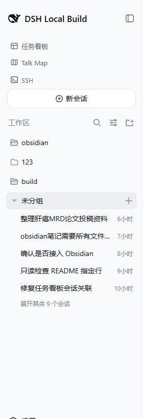

# dsh-session-workbench · DSH Web 会话管理工作台

[English](README.md) | 中文

<p align="center">
  <a href="https://github.com/Ruthtt/dsh-session-workbench/releases"></a>
  &nbsp;
  <a href="https://github.com/Ruthtt/dsh-session-workbench/actions/workflows/ci.yml"></a>
  &nbsp;
  
</p>

<p align="center">
  <strong>在熟悉的 DeepSeek Harness 侧栏中，提供专注而完整的会话工作台</strong><br>
  <em>无需离开 dsh web，即可分组、搜索、排序、迁移、导出、归档和删除会话</em>
</p>

<div align="center">

[它是什么](#它是什么) · [核心功能](#核心功能) · [快速上手](#快速上手) · [使用方法](#使用方法) · [兼容性](#兼容性) · [常见问题](#常见问题)

</div>

## 它是什么

`dsh-session-workbench` 用更适合管理的会话工作台替换 DeepSeek Harness Web GUI 原生的工作区浏览区域。它面向同时维护多个仓库、积累大量长期会话的用户，让查找、整理、迁移、备份和清理会话变得更直接。

插件在增强管理能力的同时保留 DSH 原有体验：工作区选择、新建会话、搜索、重命名、分叉、归档、中英文界面和紧凑侧栏模式仍在原来的位置工作。安装完全使用官方 Web Profile 机制，无需修改 DSH 源码。

<p align="center">
  
</p>

<p align="center"><sub>本插件只接管“工作区”区域；截图上方的其他侧栏入口来自本地 DSH Profile 中的独立插件。</sub></p>

## 能力概览

| 范围 | 工作台提供的能力 |
| --- | --- |
| 视图 | 按工作区分组，或在单列表中查看全部会话 |
| 排序 | 保持手动拖动顺序，或在会话更新时自动前移 |
| 搜索 | 合并标题匹配与 Host 提供的对话内容搜索结果 |
| 拖放 | 调整工作区和会话顺序、跨工作区迁移会话，或把会话引用交给兼容的输入框 |
| 会话生命周期 | 打开、重命名、分叉、归档、ZIP 导出和带保护的永久删除 |
| 工作区生命周期 | 添加、重命名、排序和移除工作区条目，不删除文件夹或会话记录 |
| 密集导航 | 折叠分组、先显示前五个会话、按需展开其余会话，并把未归属会话集中到“未分组” |

## 核心功能

### 整理拥挤的会话侧栏

- 在“视图选项”中切换 **按工作区** 与 **单列表**。
- 选择 **手动排序** 保持自定义顺序，或选择 **最近更新** 自动前移活跃会话。
- 拖动工作区标题保存工作区顺序；在手动排序模式下拖动会话行，调整工作区内顺序。
- 折叠暂时不关注的工作区。大型分组默认先显示五个会话，需要时再展开其余内容。
- 不属于任何工作区的会话统一放在 **未分组** 区域。
- 每一行直接显示状态和相对更新时间，并可从行详情查看会话身份。

### 同时搜索标题和对话历史

搜索框会立即返回本地标题匹配，并合并 Host 排序后的对话内容搜索结果。如果内容搜索暂时不可用，工作台仍保留标题搜索，并明确提示当前处于降级模式，不会悄悄隐藏错误。结果数量有上限，查询过宽时会提示缩小搜索范围。

### 在不同上下文之间拖动会话

- **同一工作区内：**选择手动排序，把会话拖到另一个会话之前或之后。
- **跨工作区：**把会话拖到一个真实的目标工作区。Host 会在目标中创建继承子会话，只有新会话完成持久化后才归档源会话。
- **拖到兼容输入框：**把会话拖到支持共享指针契约的输入框，插入结构化会话引用，不移动源会话。

跨工作区迁移始终由 Host 最终裁决。正在运行或不满足条件的源会话可以被拒绝，且不会修改任一工作区。

### 完整的会话操作

每个会话行保留熟悉的 **重命名**、**分叉** 和 **归档**，并增加两个生命周期工具：

- **导出会话** 下载由 Host 生成的 ZIP，其中包含选中会话及其后代。
- **删除会话** 打开明确的确认对话框，并永久删除一个持久化会话记录。

日常清理优先使用非破坏性的归档。永久删除是独立、醒目的受保护操作，拖放永远不会触发删除。

### 管理工作区但不触碰项目文件

通过标准目录流程创建或添加工作区，直接在分组中启动新会话，重命名工作区，并拖动工作区标题调整顺序。移除工作区只会删除注册表条目：文件夹和会话记录仍然保留，原有会话会显示在 **未分组** 下。

## 快速上手

### 环境要求

- DeepSeek Harness 已安装，并且 `dsh web` Profile 能正常运行。
- DSH `0.1.1-rc.2` 或更高版本。
- 永久删除和跨工作区迁移需要匹配的 Host 扩展；缺少这两个扩展时，其余侧栏功能仍可加载。

### 从 GitHub 安装

把 Release 安装到 Web Profile：

```sh
dsh plugin --profile web add github:Ruthtt/dsh-session-workbench
```

安装后重启 `dsh web`。由于 `sidebar.workspaces` 只能有一个 owner，Bundle 会停用原生 `ui-workspace` 行，再把 `dsh-session-workbench` 挂载到同一位置。

### 确认安装成功

打开左侧栏，确认“工作区”区域带有搜索、视图选项和添加工作区按钮。打开任一会话的操作菜单，确认其中包含“导出会话”和“删除会话”。

## 使用方法

### 保持自定义会话顺序

1. 打开 **视图选项**。
2. 把 **排序方式** 设为 **手动排序**。
3. 在同一工作区内把会话行拖到新的位置。

### 把会话迁移到另一个工作区

1. 确认源会话处于空闲状态，目标是一个真实工作区，而不是“未分组”。
2. 把会话行拖到目标工作区，或拖到其中某个会话的位置。
3. 等待 Host 创建并挂接继承子会话。只有该步骤成功后，源会话才会被归档。

### 导出或永久删除会话

打开会话操作菜单。选择 **导出会话** 获取 ZIP 备份，选择 **归档会话** 进行非破坏性隐藏，或选择 **删除会话** 进入带确认步骤的永久删除流程。

### 找回较早的会话

使用标题、消息片段、文件名或其他记得的文字搜索。工作台会合并本地元数据匹配与 Host 内容搜索，并在每条结果旁显示所属工作区。

## 兼容性

`0.1.0` 基于 DeepSeek Harness `0.1.1-rc.2` 构建和测试。浏览器 Bundle 自包含，类型和共享运行时模块使用官方 npm SDK 包。

| 功能 | 所需 Host 契约 | 不可用时的行为 |
| --- | --- | --- |
| 侧栏、分组、排序、重命名、分叉、归档 | 标准 DSH Client SDK | 在受支持的 DSH 版本中可用 |
| ZIP 导出 | `/api/session.export` | 路由缺失时无法启动下载 |
| 永久删除会话 | `session.delete` | 显示兼容性错误，不修改存储 |
| 跨工作区迁移 | `session.migrate` | 显示兼容性错误，源会话保持不变 |
| 拖到输入框 | `dsh:session-pointer-drag` 消费端 | 源会话保持不变；插入动作需要兼容输入框 |

## 配置

插件没有单独的设置页。视图模式、排序模式、分组展开状态和手动会话顺序会由浏览器保存，并在刷新后恢复。每个 Profile 只在一个 Bundle 层中安装一次；插件 patch 会自动替换原生工作区浏览器。

## 安全与数据行为

- **归档** 通过 Host 注册表隐藏会话，是推荐的非破坏性清理操作。
- **删除会话** 只在确认后永久删除一个持久化会话记录，不会递归删除后代或内容寻址的附件 blob。
- **删除工作区** 只移除工作区条目，不会删除目录或会话记录。
- **迁移** 创建新的继承子身份，只有目标子会话完成持久化和挂接后才归档源会话。
- 拖动载荷只包含版本与会话身份。标题、历史、引用和工作区权限由 Host 解析，不信任浏览器拖动数据。

## 常见问题

### 安装后侧栏没有变化

确认插件安装到了 `web` Profile，停止当前 Web 进程后重新启动 `dsh web`。同一个 Profile 中只安装一次本插件，确保工作区区域只有一个 owner。

### 删除或迁移提示兼容性错误

当前 Host 没有提供 `session.delete` 或 `session.migrate`。请更新到匹配的 DeepseekHarness 部署，或继续使用工作台的其他功能；失败操作不会修改存储。

### 为什么不能把会话迁移到“未分组”？

“未分组”只是显示用的收纳区域，不是真实的工作区实体。跨工作区迁移需要一个具有 Host 身份的具体目标工作区。

### 为什么“最近更新”会改变当前顺序？

该模式会在新活动出现时主动前移会话。如果希望拖动位置始终优先，请改用“手动排序”。

### 永久删除会移除子会话或项目文件吗？

不会。`0.1.0` 每次只删除一个会话记录。后代、工作区目录和内容寻址附件 blob 都不在该操作范围内。

## 已知限制

- 首个版本面向 `0.1.1-rc.2` 预发布客户端契约；后续 SDK 变化可能需要发布兼容版本。
- 跨工作区迁移会创建新的子身份并归档源会话，不会修改源会话不可变的工作目录。
- 永久删除按单个会话执行，不会递归删除后代。
- 拖到输入框复制只适用于实现共享会话指针契约的消费端。

## 开发

克隆仓库，并运行与 CI 相同的检查：

```sh
git clone https://github.com/Ruthtt/dsh-session-workbench.git
cd dsh-session-workbench
pnpm install
pnpm typecheck
pnpm test
pnpm build
pnpm pack:check
```

## 来源

工作区浏览器派生自 MIT 许可的 [`@deepseek-ai/dsh-client-ui-workspace`](https://github.com/deepseek-ai/DeepSeek-Harness) 包。署名信息见 [NOTICE](NOTICE)。

## 许可证

MIT，详见 [LICENSE](LICENSE)。

<div align="center">

[报告问题](https://github.com/Ruthtt/dsh-session-workbench/issues) · [查看 Release](https://github.com/Ruthtt/dsh-session-workbench/releases)

</div>
